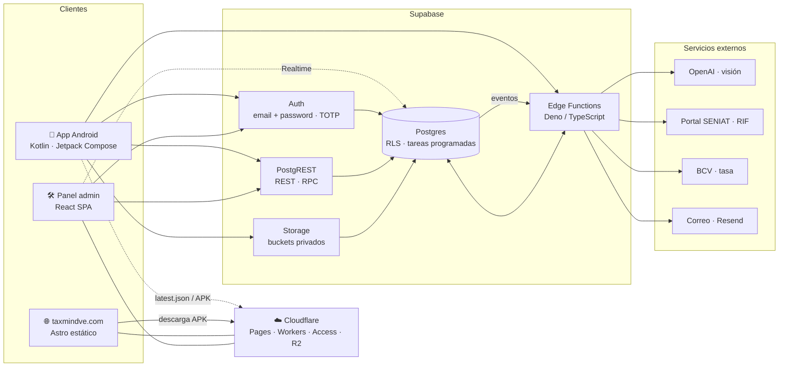

# TaxMind — architecture (English summary)

> **TaxMind** is an Android app for Venezuelan *special taxpayers* that act as **VAT
> withholding agents**: you photograph a supplier's invoice, AI extracts the fields, the
> app computes the withholding (75 % or 100 % under Providencia SNAT/2025/000054), and the
> backend issues the **official withholding receipt** with a sequential number plus the
> **TXT file** that is filed with the tax authority (SENIAT).

This documentation describes **how TaxMind is built today** — the pieces, how they talk
to each other and why the main decisions were made. The full documentation is in Spanish
(see the [README](README.md)); this page is a short summary.

🌐 Product site: [taxmindve.com](https://taxmindve.com)

---

## Overview

<!-- mmd:00-general.mmd -->

- **Android app** — the accountant's daily tool: camera → AI extraction → review →
  calculation → PDF receipt → history and fortnightly TXT. Talks to Supabase directly over
  HTTP (no SDK), with session and silent token refresh.
- **Supabase** — the whole backend: Postgres with multi-tenant *Row Level Security* (every
  row belongs to a company), Auth, Storage for invoices, receipts, signatures and identity
  documents, and Edge Functions for what must not run on the client (AI vision, atomic
  sequential number + PDF, SENIAT TXT, RIF lookup, BCV exchange rate, notifications).
- **taxmindve.com** — static site (Astro) on Cloudflare Pages: explains the product,
  publishes prices and privacy policy, delivers the APK.
- **Admin panel** — React SPA behind Cloudflare Access with mandatory TOTP: verifies legal
  representatives, validates payments, credits balances, configures plans and rate, and
  audits the platform in real time.
- **Cloudflare** — hosting for the site (Pages) and the admin (Workers Assets), access
  control for the admin (Access), and distribution of the APK and its update manifest (R2).

---

## Stack

| Component | Technology | Hosting / distribution |
|---|---|---|
| Mobile app | Kotlin, Jetpack Compose, Hilt, Retrofit + OkHttp, kotlinx-serialization, DataStore | Signed APK from the site (Cloudflare R2) · dedicated branch for Google Play |
| Backend | Supabase: Postgres + RLS, Auth, Storage, Edge Functions (Deno/TS), scheduled jobs, Realtime | Supabase Cloud |
| AI & integrations | OpenAI (vision) for invoices and identity documents · SENIAT portal (RIF) · BCV (official rate) · Resend (transactional email) | From Edge Functions |
| Public site | Astro (static output), sitemap, single data file | Cloudflare Pages, automated CI deploy |
| Admin panel | React 19, Vite, React Router, TanStack Query, Recharts, supabase-js | Cloudflare Workers Assets + Cloudflare Access |

---

## Key design decisions

1. **One backend, several clients** — app and admin consume the same Postgres under the
   same RLS policies; authorization is not duplicated per client.
2. **Multi-tenant by company** — a user only sees the companies they belong to, and within
   them only what their role (admin / operator) allows.
3. **Privileged work runs server-side** — issuing a sequential number, calling OpenAI,
   querying SENIAT or sending email happens in database functions or Edge Functions; the
   client never receives elevated credentials.
4. **Migrations are the source of truth** for schema *and* security; every new table is
   closed by default and opened explicitly.
5. **Legal-representative verification happens outside the app** — the app only declares
   and provides non-authoritative signals (AI reading of the ID document, RIF lookup); a
   person enables the company from the admin panel. Without it, no receipts are issued.
6. **Direct APK distribution** with in-app updates driven by a public manifest (version,
   URL, SHA-256, minimum supported version, terms version), plus a branch for Play.
7. **Prepaid credits, manual payment reporting** — 1 credit = 1 receipt; the company pays
   through its bank and reports with a screenshot; the team verifies and credits.

The Spanish docs cover each topic in depth: [overview](docs/01-vision-general.md),
[Android app](docs/02-app-android.md), [Supabase backend](docs/03-backend-supabase.md),
[data model](docs/04-modelo-de-datos.md), [security](docs/05-seguridad.md),
[flows](docs/06-flujos.md), [site & admin](docs/07-sitio-y-admin.md),
[decisions (ADRs)](docs/08-decisiones.md),
[infrastructure & deployment](docs/09-infraestructura-y-despliegue.md).

---

## TaxMind in numbers

Metrics about the **code**, not the business.

<!-- metricas:inicio -->

| Metric | Value |
|---|---|
| SQL migrations | 78 |
| Business tables (public schema) | 23 |
| Edge Functions | 11 |
| Storage buckets | 7 |
| Compose screens / ViewModels | 13 / 14 |
| Lines of code | Kotlin 19.620 · SQL 11.370 · TypeScript (functions) 5.235 · Astro 3.048 · TypeScript (admin) 8.410 |
| Tests | 18 JVM classes · 5 Deno unit · 17 E2E scripts |
| Current app version | 0.7.5 |
| Site pages / admin views | 4 / 15 |
| Commits (app + site + admin) | 141 |
| First commit | 2026-06-23 |

_Computed on 2026-08-17 with [`scripts/metricas.sh`](scripts/metricas.sh)._

<!-- metricas:fin -->

---

## Status

In production since July 2026; app version **0.7.5** (August 2026). It covers the full
cycle: onboarding and legal-representative verification, AI invoice extraction,
calculation with IGTF and exempt invoices, credit and debit notes, PDF receipt with
signature and stamp, history, fortnightly TXT, credits and payments, multi-company
collaboration and the admin panel. Last update of this documentation: **17 August 2026**.

## License

Text and diagrams under [CC BY-NC-ND 4.0](LICENSE): you may read and share them with
attribution, without commercial use or derivative works.
