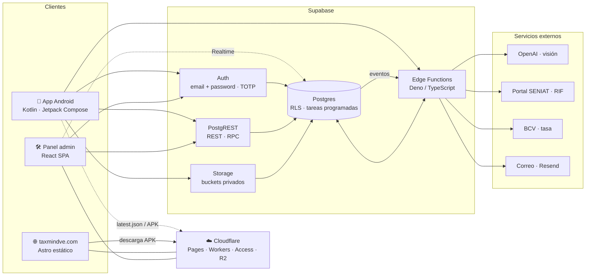
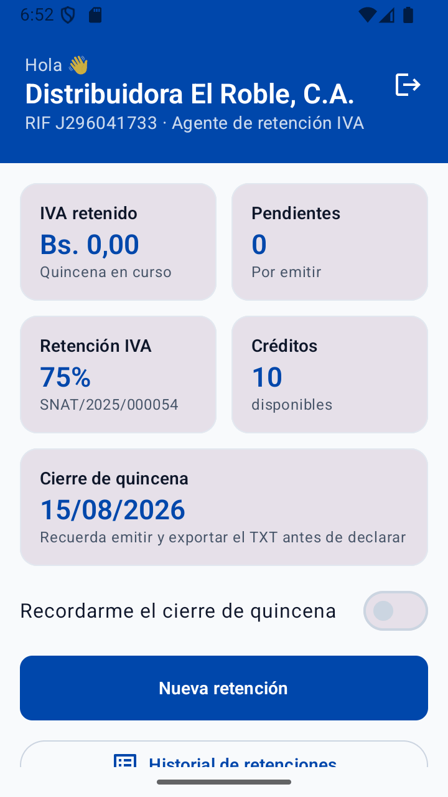
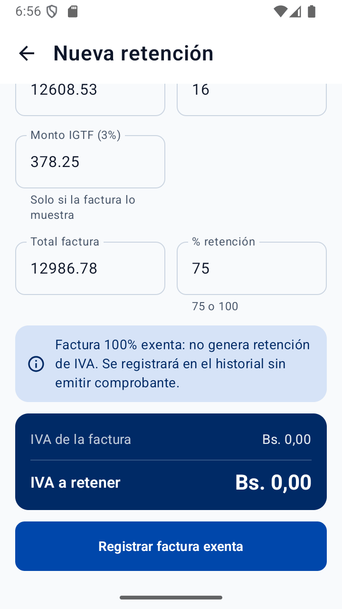
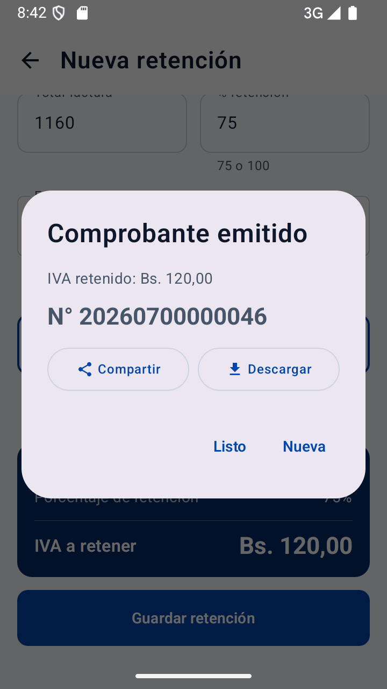
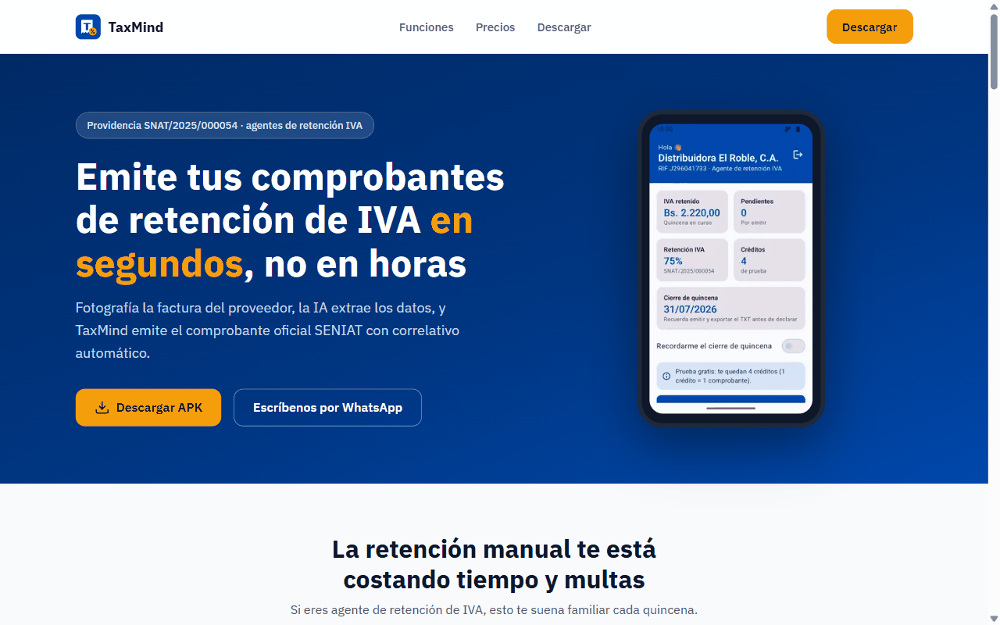

# TaxMind — arquitectura

> **TaxMind** es una app Android para contribuyentes especiales venezolanos que actúan como
> **agentes de retención de IVA**: fotografías la factura del proveedor, la IA extrae los
> datos, la app calcula la retención (75 % o 100 % según la Providencia SNAT/2025/000054) y
> el backend emite el **comprobante oficial** con correlativo y el **TXT** que se declara
> ante el SENIAT.

Esta documentación describe **cómo está construido TaxMind hoy**: qué piezas lo forman,
cómo se comunican y por qué se tomaron las decisiones principales.

🌐 Sitio del producto: [taxmindve.com](https://taxmindve.com) · 🇬🇧 [English summary](README.en.md)

---

## Vista general

<!-- mmd:00-general.mmd -->

En una frase por pieza:

- **App Android** — la herramienta de trabajo del contador: cámara → extracción por IA →
  revisión → cálculo → comprobante PDF → historial y TXT quincenal. Habla con Supabase
  directamente por HTTP (sin SDK), con sesión y refresh silencioso de token.
- **Supabase** — todo el backend: Postgres con *Row Level Security* multi-tenant (cada fila
  pertenece a una empresa), Auth, Storage para facturas, comprobantes, firmas y documentos
  de identidad, y Edge Functions para lo que no debe correr en el cliente (visión IA,
  correlativo atómico + PDF, TXT SENIAT, consulta de RIF, tasa BCV, notificaciones).
- **taxmindve.com** — sitio estático (Astro) en Cloudflare Pages: explica el producto,
  publica precios y política de privacidad y entrega el APK.
- **Panel admin** — SPA React detrás de Cloudflare Access con TOTP obligatorio: verifica
  responsables legales, valida pagos, acredita créditos, configura planes y tasa, y
  audita la plataforma en tiempo real.
- **Cloudflare** — hosting del sitio (Pages) y del admin (Workers Assets), control de
  acceso al admin (Access) y distribución del APK y su manifiesto de actualización (R2).

---

## Stack por componente

| Componente | Tecnología | Hosting / distribución |
|---|---|---|
| App móvil | Kotlin, Jetpack Compose, Hilt, Retrofit + OkHttp, kotlinx-serialization, DataStore | APK firmado desde el sitio (Cloudflare R2) · rama dedicada para Google Play |
| Backend | Supabase: Postgres + RLS, Auth, Storage, Edge Functions (Deno/TS), tareas programadas, Realtime | Supabase Cloud |
| IA e integraciones | OpenAI (visión) para facturas y documentos de identidad · portal SENIAT (RIF) · BCV (tasa oficial) · Resend (correo transaccional) | Desde Edge Functions |
| Sitio público | Astro (salida estática), sitemap, datos en un solo archivo | Cloudflare Pages, deploy automático por CI |
| Panel admin | React 19, Vite, React Router, TanStack Query, Recharts, supabase-js | Cloudflare Workers Assets + Cloudflare Access |

---

## Documentación

| # | Documento | Qué explica |
|---|---|---|
| 01 | [Visión general](docs/01-vision-general.md) | Los cuatro componentes y cómo se conectan (C4 contexto y contenedores) |
| 02 | [App Android](docs/02-app-android.md) | MVVM + capas limpias, paquetes, red contra los HTTP APIs de Supabase, navegación, flavors |
| 03 | [Backend Supabase](docs/03-backend-supabase.md) | Migraciones como fuente de verdad, Edge Functions, buckets, cron y notificaciones |
| 04 | [Modelo de datos](docs/04-modelo-de-datos.md) | ERD conceptual: empresas, miembros, responsables, proveedores, facturas, retenciones, declaraciones, créditos |
| 05 | [Seguridad](docs/05-seguridad.md) | Capas de autorización multi-tenant, verificación del responsable fuera de la app, señales no autoritativas |
| 06 | [Flujos](docs/06-flujos.md) | Secuencias: onboarding, foto → comprobante, notas de crédito/débito, TXT SENIAT, créditos |
| 07 | [Sitio y panel admin](docs/07-sitio-y-admin.md) | taxmindve.com (Astro/Pages) y admin (React/Workers/Access) |
| 08 | [Decisiones](docs/08-decisiones.md) | ADRs cortos: por qué Supabase, por qué sin SDK, por qué APK directo, etc. |
| 09 | [Infraestructura y despliegue](docs/09-infraestructura-y-despliegue.md) | Entornos local/prod, ciclo de release, CI, costos |

Las fuentes Mermaid de todos los diagramas están en [`diagramas/`](diagramas/).

---

## TaxMind en números

Métricas del **código**, no del negocio.

<!-- metricas:inicio -->

| Métrica | Valor |
|---|---|
| Migraciones SQL | 78 |
| Tablas de negocio (esquema público) | 23 |
| Edge Functions | 11 |
| Buckets de Storage | 7 |
| Pantallas Compose / ViewModels | 13 / 14 |
| Líneas de código | Kotlin 19.620 · SQL 11.370 · TypeScript (funciones) 5.235 · Astro 3.048 · TypeScript (admin) 8.410 |
| Tests | 18 clases JVM · 5 unitarios Deno · 17 scripts E2E |
| Versión actual de la app | 0.7.5 |
| Páginas del sitio / vistas del admin | 4 / 15 |
| Commits (app + sitio + admin) | 141 |
| Primer commit | 2026-06-23 |

_Calculado el 2026-08-17 con [`scripts/metricas.sh`](scripts/metricas.sh)._

<!-- metricas:fin -->

---

## Capturas

  
  
  

  

Capturas de la app (empresa demo, datos ficticios) y del sitio público. Fuentes en
[`img/capturas/`](img/capturas/).

---

## Estado del proyecto

- **En producción** desde julio de 2026; app en versión **0.7.5** (agosto de 2026).
- Cubre el ciclo completo: onboarding y verificación del responsable legal, extracción de
  facturas por IA, cálculo con IGTF y facturas exentas, notas de crédito y débito,
  comprobante PDF con firma y sello, historial, TXT de quincena, créditos y pagos,
  colaboración multiempresa y panel de administración.
- Última actualización de esta documentación: **17 de agosto de 2026**.

---

## Licencia

Texto y diagramas bajo [CC BY-NC-ND 4.0](LICENSE): puedes leerlos y compartirlos con
atribución, sin uso comercial ni obras derivadas.
