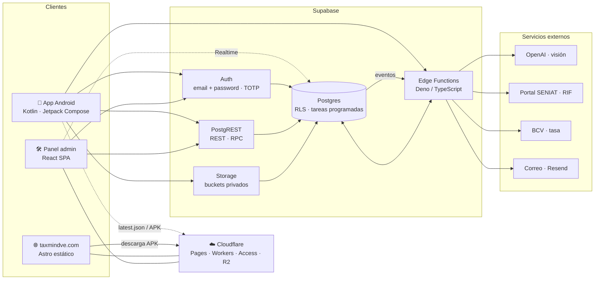
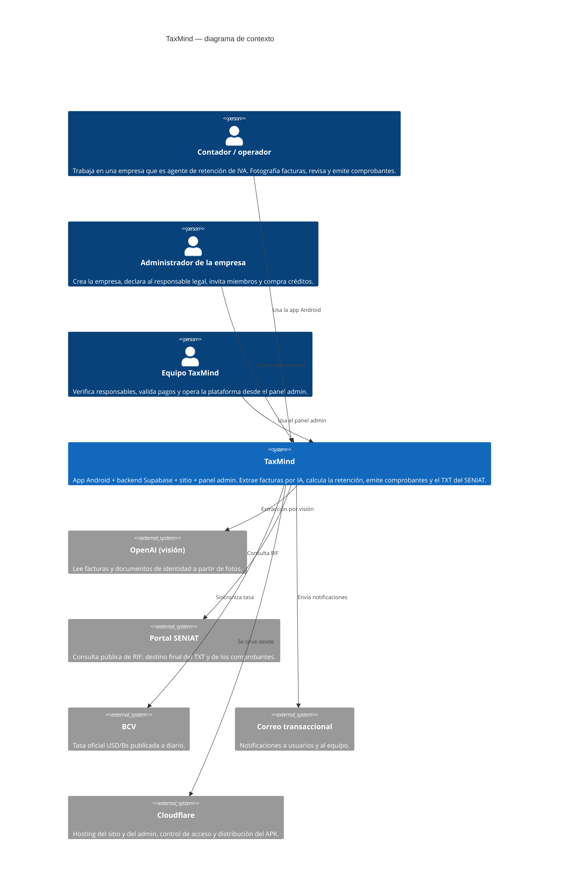
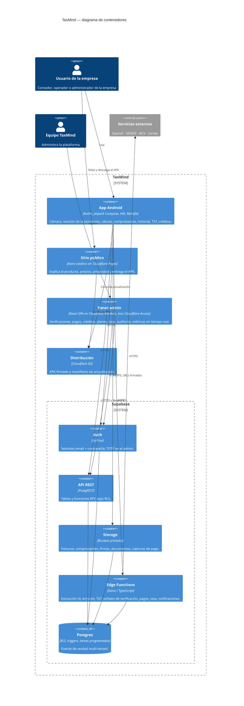

# Visión general

TaxMind son **cuatro piezas** que se despliegan por separado y comparten un solo backend.
Este documento presenta esas piezas, quién habla con quién y por qué protocolo. Los
detalles de cada una están en los documentos siguientes.

---

## Las cuatro piezas

| Pieza | Qué es | Base de código |
|---|---|---|
| **App Android** | Kotlin + Jetpack Compose. La herramienta diaria del contador: cámara → extracción por IA → revisión → cálculo → comprobante → historial y TXT. | `RetencionFast` (nombre histórico del proyecto; el producto se llama TaxMind) |
| **Backend Supabase** | Postgres con RLS, Auth, Storage, Edge Functions (Deno), tareas programadas y Realtime. Vive en la carpeta `supabase/` del mismo repo que la app: migraciones y funciones se versionan junto al cliente que las consume. | `RetencionFast/supabase` |
| **Sitio público** | taxmindve.com. Astro estático en Cloudflare Pages: qué es el producto, precios, privacidad, términos y descarga del APK. | `taxmind-website` |
| **Panel admin** | admin.taxmindve.com. SPA React en Cloudflare Workers, detrás de Cloudflare Access y con TOTP obligatorio. Verifica responsables, valida pagos, acredita créditos, configura planes y tasa, audita. | `taxmind-admin` |

---

## Diagrama general

<!-- mmd:00-general.mmd -->

---

## Contexto (C4 nivel 1)

Quién usa TaxMind y de qué sistemas externos depende.

<!-- mmd:01-contexto-c4.mmd -->

Tres tipos de persona:

- **Contador / operador** — usa la app para registrar facturas y emitir comprobantes.
- **Administrador de la empresa** — además crea la empresa, declara al responsable legal,
  invita a otros usuarios y compra créditos.
- **Equipo TaxMind** — opera la plataforma desde el panel admin: verifica responsables,
  valida pagos, acredita créditos.

Cinco sistemas externos, todos consumidos **desde el backend**, nunca desde la app:
visión de OpenAI (facturas y documentos de identidad), portal del SENIAT (consulta de
RIF), BCV (tasa oficial), correo transaccional (Resend) y Cloudflare (hosting,
distribución del APK y control de acceso al admin).

---

## Contenedores (C4 nivel 2)

Las unidades desplegables y sus protocolos.

<!-- mmd:02-contenedores-c4.mmd -->

Cómo se comunican:

| De → a | Protocolo | Notas |
|---|---|---|
| App → Auth / REST / Storage / Functions | HTTPS con token de sesión (JWT) | Retrofit directo contra los HTTP APIs de Supabase, sin SDK. Cada llamada pasa por el gateway de Supabase, que valida el JWT; luego Postgres aplica permisos por tabla y RLS por fila. |
| App → Postgres (vía REST) | REST sobre tablas y llamadas RPC | Lo transaccional que puede resolverse en SQL (crear empresa, listar historial, anular, registrar la declaración) va por RPC en Postgres. |
| App → Edge Functions | HTTPS | Lo que necesita servicios externos o privilegios (extracción por IA, emisión del comprobante con correlativo atómico y PDF, TXT, comprobante de pago). |
| App → Cloudflare R2 | HTTPS público, sin credenciales | Manifiesto de la última versión y descarga del APK. |
| Panel admin → Auth / REST | HTTPS con JWT + segundo factor | Además de la sesión, Cloudflare Access filtra por correo antes de servir la SPA. |
| Panel admin ⇐ Postgres | Realtime (WebSocket) | El admin se suscribe a cambios para mostrar alertas y contadores al instante. Sólo el admin usa Realtime; la app consulta bajo demanda. |
| Postgres → Edge Functions | Eventos internos | Ciertos cambios de estado en la base de datos disparan notificaciones por correo (por ejemplo, al verificar un responsable o al reportar un pago). |
| Edge Functions → externos | HTTPS | OpenAI, SENIAT, BCV, correo. Las claves de esos servicios sólo existen en el servidor. |
| Sitio → R2 | Enlace | El botón "Descargar APK" apunta al dominio de descargas; el sitio no tiene backend propio. |

---

## Principios que atraviesan todo

1. **Un backend, varios clientes.** App, admin y (en el futuro) cualquier otro cliente
   consumen el mismo Postgres con las mismas políticas RLS; no hay lógica de autorización
   duplicada por cliente.
2. **Multi-tenant por empresa.** Cada fila de negocio pertenece a una empresa; un usuario
   ve sólo las empresas de las que es miembro y, dentro de ellas, sólo lo que su rol
   permite. Ver [Modelo de datos](04-modelo-de-datos.md) y [Seguridad](05-seguridad.md).
3. **Lo privilegiado corre en el servidor.** Emitir un correlativo, llamar a OpenAI, hablar
   con el SENIAT o enviar correo pasa por Edge Functions o funciones de base de datos con
   privilegios; el cliente nunca recibe credenciales elevadas.
4. **Las migraciones son la fuente de verdad** del esquema y de la seguridad. Ver
   [Backend Supabase](03-backend-supabase.md).
5. **Distribución directa del APK** con actualización in-app y una rama aparte para Play.
   Ver [Infraestructura y despliegue](09-infraestructura-y-despliegue.md).

[← Volver al índice](../README.md)
