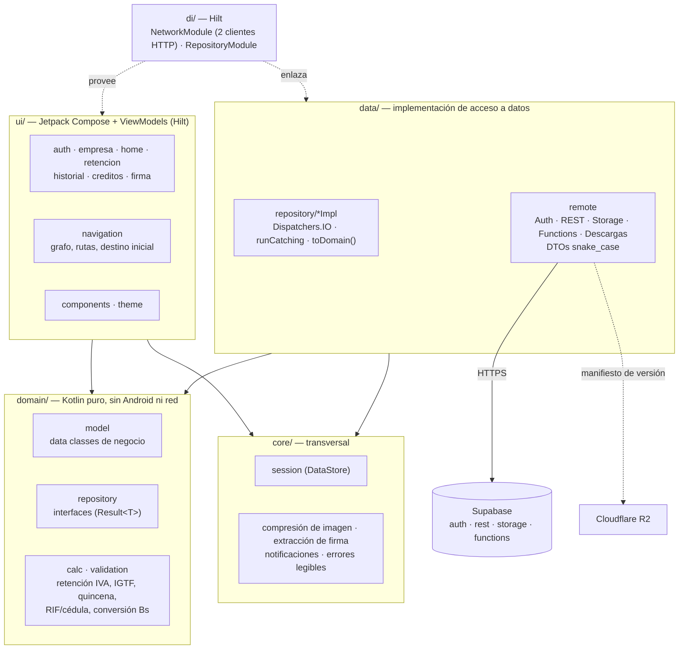
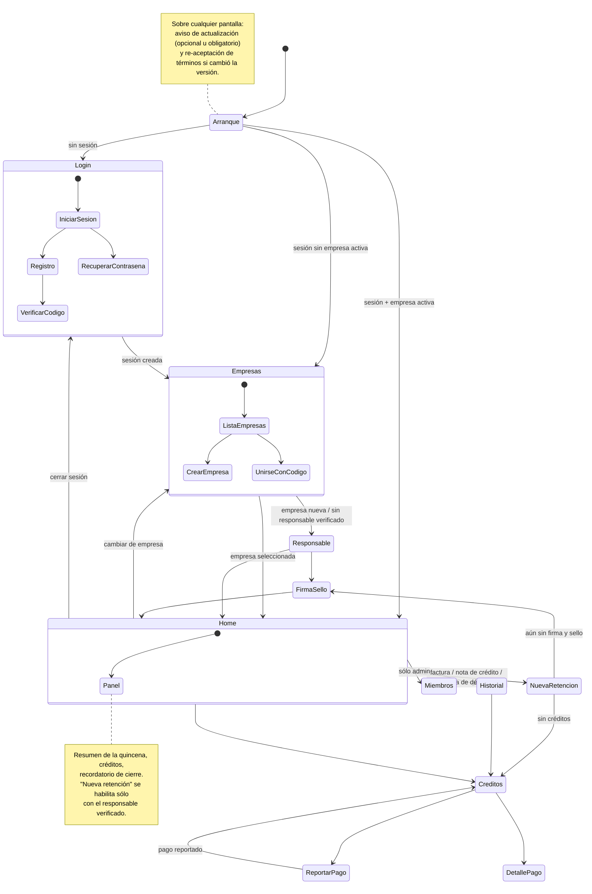

# App Android

La app es la herramienta de trabajo del contador: fotografía la factura, revisa lo que
extrajo la IA, calcula la retención, emite el comprobante y, al cerrar la quincena,
exporta el TXT. Está escrita en **Kotlin** con **Jetpack Compose** y una sola `Activity`.

> Este documento describe la arquitectura tal como está en producción (versión 0.7.x,
> agosto de 2026). Los fragmentos de código son **ilustrativos** — muestran el patrón, no
> reproducen el código real.

---

## Stack

| Área | Tecnología |
|---|---|
| Lenguaje / UI | Kotlin 2.0, Jetpack Compose (Material 3), Navigation Compose |
| Inyección de dependencias | Hilt (+ KSP), Hilt Navigation Compose, Hilt Work |
| Red | Retrofit 2 + OkHttp 4, convertidor kotlinx-serialization |
| Serialización | kotlinx-serialization (JSON) |
| Persistencia local | DataStore Preferences (sesión, onboarding, preferencias de aviso) |
| Trabajo en segundo plano | WorkManager (recordatorio de cierre de quincena) |
| Imagen | Cámara y galería del sistema (`ActivityResultContracts`), recorte con `android-image-cropper`, corrección EXIF |
| Códigos QR | ZXing (generación local del QR con los datos de pago) |
| Mínimos | `minSdk 26` (Android 8.0), `targetSdk 35`, JVM 17 |
| Tests | JUnit 4 sobre la JVM (18 clases de prueba: cálculo, mapeo, reglas de UI y notificaciones) |

Lo que **no** usa, a propósito: el SDK oficial de Supabase para Kotlin (ver más abajo),
CameraX (la cámara del sistema basta para una foto por factura), ni librerías de carga de
imágenes remotas (las imágenes se descargan a archivo por URL firmada y se muestran desde
disco).

---

## Capas

<!-- mmd:03-capas-android.mmd -->


Es MVVM con una separación "limpia" pragmática: tres capas y una transversal.

- **`ui/<feature>/`** — una carpeta por funcionalidad (`auth`, `empresa`, `home`,
  `retencion`, `historial`, `creditos`, `firma`), cada una con sus pantallas Compose y su
  `ViewModel` (`@HiltViewModel`). Los ViewModels exponen `StateFlow` de estado de
  pantalla y hablan sólo con **interfaces** de repositorio. `ui/navigation/` contiene el
  grafo, las rutas y un `RootViewModel` que decide el destino inicial a partir del estado
  de sesión y, en paralelo, comprueba si hay una versión nueva de la app o una versión
  nueva de los términos que haya que aceptar.
- **`domain/`** — Kotlin puro (sin Android, sin red): modelos de negocio, interfaces de
  repositorio y la lógica que debe poder probarse en la JVM en milisegundos:
  - `calc/` — retención de IVA (75 % / 100 % sobre el IVA de la factura), cuadre del
    total con IGTF aparte, período y quincena en hora de Venezuela, validación de la
    fecha de emisión y del formato del número de comprobante, conversión USD → Bs con
    tasa BCV (con caducidad si la tasa es vieja) y total de un paquete de créditos.
  - `validation/` — formato de RIF (con dígito verificador) y de cédula, sin red.
- **`data/`** — `remote/` con las interfaces Retrofit y los DTOs; `repository/*Impl` que
  implementan las interfaces del dominio.
- **`core/`** — transversal: sesión (DataStore), constantes de URLs, compresión de imagen
  antes de subir, extracción determinista de firma y sello desde una foto (sin IA, sin
  costo), notificaciones (recordatorio de quincena y aviso de cambio de estado de un
  pago) y la traducción de errores HTTP/Postgres a mensajes legibles.
- **`di/`** — módulos Hilt: el de red construye los clientes HTTP y las APIs; el de
  repositorios enlaza cada interfaz con su implementación.

Regla de dependencia: `ui` y `data` dependen de `domain`; `domain` no depende de nadie.
La lógica fiscal crítica (quincena, cuadre, formato del número) existe **también** en el
backend; la copia en `domain/calc` es un espejo probado en la JVM que permite validar en
el formulario antes de llamar al servidor.

---

## Red: Retrofit contra los HTTP APIs de Supabase, sin SDK

La app no usa `supabase-kt`. Habla directamente con los cuatro servicios HTTP que expone
un proyecto Supabase, cada uno con su interfaz Retrofit:

| Interfaz | Servicio | Para qué |
|---|---|---|
| Auth | `/auth/v1` | registro, inicio de sesión, refresh, recuperación, verificación por código |
| REST | `/rest/v1` | tablas y funciones RPC de Postgres, bajo RLS (PostgREST) |
| Storage | `/storage/v1` | subir la foto de la factura o del documento; descargar PDFs por URL firmada |
| Functions | `/functions/v1` | operaciones que no deben correr en el cliente: extracción por IA, emisión del comprobante, TXT, comprobante de pago |
| Descargas | dominio público de descargas | leer el manifiesto de la última versión publicada |

Por qué sin SDK:

1. **Control total del cliente HTTP** — un único `OkHttpClient` configurable
   (interceptores, timeouts largos sólo para las funciones con IA, logging sólo en debug).
2. **Refresh silencioso del token** con un `Authenticator` de OkHttp: cuando una llamada
   recibe 401, se renueva la sesión una sola vez (con un candado para que llamadas
   concurrentes no disparen varios refresh) y se reintenta; si el refresh falla, se limpia
   la sesión y la app vuelve al Login.
3. **Menos dependencias** y DTOs propios que reflejan exactamente el JSON de Supabase.

Hay **dos** clientes HTTP con cualificadores Hilt (y un tercero "limpio" para el
manifiesto de actualización, que vive en otro dominio y no debe llevar credenciales):

```kotlin
// Ilustrativo: dos OkHttpClient para separar el que autentica del que se autentica.
@Provides @Singleton @AuthClient
fun authClient(auth: AuthInterceptor): OkHttpClient =
    OkHttpClient.Builder()
        .addInterceptor(auth)          // apikey + Bearer (si hay sesión)
        .build()                       // SIN authenticator: evita el ciclo refresh → refresh

@Provides @Singleton @ApiClient
fun apiClient(auth: AuthInterceptor, refresher: TokenAuthenticator): OkHttpClient =
    OkHttpClient.Builder()
        .addInterceptor(auth)
        .authenticator(refresher)      // ante 401: renueva el token y reintenta una vez
        .build()
```

Los DTOs conservan los nombres `snake_case` del JSON y se convierten a modelos de dominio
`camelCase` con mappers explícitos:

```kotlin
// Ilustrativo
@Serializable
data class ProveedorDto(val id: String, val rif: String, val razon_social: String)

fun ProveedorDto.toDomain() = Proveedor(id = id, rif = rif, razonSocial = razon_social)
```

Los repositorios devuelven `Result<T>` y corren en `Dispatchers.IO`; nunca lanzan
excepciones hacia el ViewModel:

```kotlin
// Ilustrativo
class ProveedorRepositoryImpl @Inject constructor(private val api: RestApi) : ProveedorRepository {
    override suspend fun listar(empresaId: String): Result<List<Proveedor>> =
        withContext(Dispatchers.IO) {
            runCatching { api.proveedores(empresaId).map { it.toDomain() } }
        }
}
```

Y en el ViewModel:

```kotlin
// Ilustrativo
viewModelScope.launch {
    _estado.update { it.copy(cargando = true) }
    repo.listar(empresaId)
        .onSuccess { lista -> _estado.update { it.copy(cargando = false, proveedores = lista) } }
        .onFailure { e -> _estado.update { it.copy(cargando = false, error = e.toUserMessage()) } }
}
```

Las llamadas "de cortesía" que no deben romper el flujo principal (por ejemplo, disparar
la lectura del documento de identidad justo después de guardar al responsable) van en
`runCatching` y se documentan como *silent-failure* en el código.

---

## Sesión y estado local

- **Sesión** en DataStore: token de acceso, token de refresh, id de usuario e id de la
  empresa activa. Un `Flow` de sesión alimenta al grafo de navegación: si la sesión se
  vacía (refresh fallido o cierre de sesión), la app vuelve al Login desde donde esté.
- **Preferencias separadas** para onboarding (tutorial y consejos de foto ya vistos) y
  para el recordatorio de quincena, en DataStores distintos a propósito: cerrar sesión
  limpia la sesión, no las preferencias del dispositivo.

---

## Navegación

<!-- mmd:04-navegacion-app.mmd -->


Puntos clave:

- El **destino inicial** sale del estado de sesión: sin sesión → Login; con sesión pero
  sin empresa activa → selección de empresa; con ambas → Home.
- **Responsable legal**: al crear una empresa se pasa por la pantalla del responsable;
  el Home muestra el estado (pendiente / verificado / rechazado) y "Nueva retención" sólo
  se habilita cuando está verificado (ver [Seguridad](05-seguridad.md)).
- **Nueva retención** recibe el tipo de documento (factura, nota de crédito o nota de
  débito). Si el servidor responde que no quedan créditos, la ruta se reemplaza por la de
  Créditos.
- **Deeplinks** propios para abrir el historial filtrado por pendientes (desde el
  recordatorio de quincena) y el detalle de un pago (desde el aviso de pago verificado o
  rechazado).
- Sobre cualquier pantalla pueden aparecer dos diálogos globales: el aviso de
  **actualización** (opcional u obligatorio) y la **re-aceptación de términos** cuando el
  manifiesto publica una versión de términos mayor que la aceptada.

---

## Flavors: `prod` y `local`

Hay una dimensión de producto `entorno` con dos sabores que **conviven instalados**:

| Flavor | Backend | Detalles |
|---|---|---|
| `prod` | proyecto Supabase real | URL del manifiesto de actualización activa |
| `local` | stack Docker del CLI de Supabase (`supabase start`) | sufijo en el `applicationId` y en el `versionName`; URL sobreescribible desde `local.properties`; sin aviso de actualización; permite tráfico HTTP en claro sólo hacia el stack local |

Con el flavor `local` y `adb reverse` el teléfono físico habla con el Postgres, Auth,
Storage y Edge Runtime que corren en el PC, así que migraciones y funciones se prueban de
punta a punta sin tocar producción. Ver
[Infraestructura y despliegue](09-infraestructura-y-despliegue.md).

---

## Actualización in-app (distribución fuera de Play)

Al arrancar, la app lee un **manifiesto público** (`latest.json`, servido desde Cloudflare
R2 con dominio propio) con la versión publicada, la URL del APK, su hash SHA-256, la
versión mínima aún soportada y la versión vigente de los términos. Con eso:

- si la instalada es menor que la publicada → aviso **opcional** ("Más tarde" lo pospone
  hasta el próximo arranque);
- si es menor que la mínima soportada → aviso **obligatorio**, la app queda bloqueada
  hasta actualizar;
- la descarga se abre en el navegador; Android instala el APK encima (misma firma,
  `versionCode` mayor) sin perder la sesión.

Existe además una rama de publicación separada para Google Play (donde el cobro embebido
se desactiva por bandera de compilación).

---

## Qué hace la app, en una lista

Onboarding (registro con verificación por código, términos, recuperación de contraseña) ·
empresas (crear, editar, unirse por código de invitación, cambiar de empresa) ·
responsable legal con foto del documento · firma y sello por foto · panel de la quincena ·
nueva retención por foto o manual, notas de crédito y débito, facturas 100 % exentas,
IGTF aparte, alta de proveedor al vuelo · número de comprobante inicial configurable la
primera vez · comprobante PDF (ver, compartir, guardar) · historial con búsqueda, filtros
por estado, mes, quincena y proveedor · anulación con motivo · TXT SENIAT de la quincena y
marcado de "declarada" · créditos (saldo, paquetes, reporte de pago con captura y QR,
monto en Bs a tasa BCV, comprobante de pago) · gestión de miembros e invitaciones (sólo
admin) · recordatorio de cierre de quincena · aviso de actualización.

Los flujos completos, con sus diagramas de secuencia, están en [Flujos](06-flujos.md).

[← Volver al índice](../README.md)
