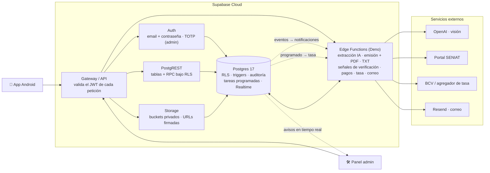

# Backend Supabase

Todo el backend de TaxMind es un proyecto **Supabase**: Postgres con *Row Level Security*,
Auth, Storage, Edge Functions (Deno/TypeScript), tareas programadas y Realtime. No hay un
servidor de aplicación propio: la lógica de negocio vive en SQL (funciones, triggers,
políticas) y en un puñado de Edge Functions para lo que necesita servicios externos o
privilegios.

> Los fragmentos SQL de este documento son ilustrativos, sobre una tabla ficticia.

---

## Despliegue

<!-- mmd:05-despliegue-supabase.mmd -->


| Servicio | Papel en TaxMind |
|---|---|
| **Gateway** | Toda petición entra por aquí con su JWT; sin sesión válida no llega a nada. |
| **Auth** | Correo + contraseña, con confirmación por código y recuperación por código. El panel admin exige además un segundo factor TOTP. Plantillas de correo propias. |
| **PostgREST** | Expone las tablas y las funciones RPC del esquema público, siempre bajo RLS. Es la API que usa la app para casi todo lo transaccional. |
| **Storage** | Buckets **privados** por tipo de archivo; acceso por sesión y, cuando hace falta un enlace, por URL firmada de corta vida. |
| **Edge Functions** | Deno/TypeScript. Lo que no debe correr en el cliente: visión IA, emisión con PDF, TXT, señales de verificación, pagos, tasa, correo. |
| **Postgres 17** | La fuente de verdad: esquema, RLS, triggers de protección y auditoría, funciones RPC, extensiones de tareas programadas y peticiones HTTP salientes, Realtime. |

---

## Migraciones como fuente de verdad

El esquema **y** la seguridad se definen exclusivamente en migraciones SQL con marca de
tiempo (unas 80 archivos a agosto de 2026, desde junio de 2026), aplicadas en orden por el
CLI de Supabase. Nada se cambia a mano en producción: si no está en una migración, no
existe. Cada migración que crea una tabla sigue el mismo orden canónico:

```sql
-- Ilustrativo: esqueleto de una migración tipo sobre una tabla ficticia.
-- 1) La tabla, siempre con la organización (empresa) dueña de la fila.
create table public.notas_internas (
  id              uuid primary key default gen_random_uuid(),
  organizacion_id uuid not null references public.organizaciones (id) on delete cascade,
  texto           text not null,
  creado_en       timestamptz not null default now()
);

-- 2) RLS encendido desde el primer segundo.
alter table public.notas_internas enable row level security;

-- 3) Políticas: sólo miembros de la empresa; escribir requiere ser admin.
create policy "miembros leen"
  on public.notas_internas for select to authenticated
  using (organizacion_id in (select interno.organizaciones_del_usuario()));

create policy "admins escriben"
  on public.notas_internas for insert to authenticated
  with check (interno.es_admin_de(organizacion_id));

-- 4) Grants explícitos: exactamente los comandos que tienen política. Nada para anon.
grant select, insert on public.notas_internas to authenticated;
grant all on public.notas_internas to service_role;
```

Por qué así:

- **Cerrado por defecto.** Las versiones recientes de la plataforma ya no otorgan
  privilegios automáticos sobre tablas nuevas, así que cada tabla declara sus grants. La
  regla es simple: al rol de usuario autenticado se le concede *exactamente* el comando
  para el que existe una política RLS; las tablas internas (contadores, cupos,
  configuración de plataforma) no reciben ningún grant y sólo las tocan funciones con
  privilegios; el rol de servidor tiene DML completo y su clave nunca sale del backend; el
  rol anónimo no tiene nada (la app exige sesión para todo).
- **Dos capas que se refuerzan.** PostgREST comprueba primero el grant de tabla ("¿puede
  este rol tocar la tabla?") y después RLS ("¿qué filas?"). Un error en una capa lo
  atrapa la otra.
- **Los helpers de RLS viven en un esquema no expuesto** por la API, para que no aparezcan
  como endpoints públicos.
- **Migraciones nuevas, nunca editadas.** Un cambio de criterio se expresa como otra
  migración (por ejemplo, la que pasó explícitamente por todas las tablas para declarar
  grants, o la que cerró un camino de auto-vinculación a empresas).

Lo que **no** va en migraciones, a propósito: datos por entorno (cuentas de cobro reales,
secretos, la programación concreta de las tareas periódicas). El repositorio sólo lleva
valores de ejemplo inactivos.

---

## Modelo multi-tenant en una frase

Cada fila de negocio lleva la empresa a la que pertenece; una política RLS comprueba que
el usuario de la sesión es miembro de esa empresa (o admin, para las operaciones
sensibles). Ver [Modelo de datos](04-modelo-de-datos.md) y [Seguridad](05-seguridad.md).

---

## Lógica en la base de datos

Buena parte de las reglas del dominio son SQL, porque ahí son transaccionales, se aplican
a cualquier cliente y no se pueden saltar desde la app:

- **Funciones RPC** para las operaciones que deben ser atómicas: crear una empresa con su
  primer administrador, emitir un comprobante (asignar el correlativo, fijar el número y
  la fecha, descontar el crédito — todo o nada), anular con motivo, registrar que la
  quincena ya fue declarada, aceptar una invitación por código, consultar el estado de
  créditos.
- **Triggers de validación**: formato y dígito verificador de RIF y cédula, cuadre de
  totales de la factura, reglas de las notas de crédito y débito (misma empresa y
  proveedor que la factura afectada, tope acumulado, misma quincena).
- **Triggers de protección**: ciertos campos sólo los puede escribir el servidor (número
  de comprobante, fecha de emisión, estado de un pago, verificación del responsable). La
  app puede escribir la fila, pero esos campos se ignoran o se fuerzan al valor seguro.
- **Auditoría** por empresa de las acciones con valor probatorio (crear/editar empresa y
  proveedores, registrar responsable, emitir, anular, exportar TXT, declarar quincena,
  invitaciones y cambios de miembros), con el usuario, la fecha y un detalle en JSON.
  Los cambios "de ruido" (señales automáticas de verificación) no se auditan. El panel
  admin tiene su propia auditoría, incluidas las lecturas sensibles.
- **Correlativo atómico**: un contador por empresa y período que se incrementa dentro de
  la misma transacción que emite el comprobante; una restricción de unicidad por empresa y
  número es la segunda barrera. Número de 14 caracteres (año-mes de emisión + 8 dígitos)
  conforme a la Providencia. La primera emisión de una empresa puede fijar el número
  inicial para continuar la secuencia de un sistema anterior.
- **Período y quincena por fecha de emisión**: mientras la retención está pendiente se
  estima por la fecha de la factura; al emitir se recalcula por la fecha de emisión (hora
  de Venezuela), que es la que se declara.
- **Créditos**: saldo materializado por empresa más un libro mayor inmutable
  (prueba gratis, compra, consumo, ajuste). El consumo ocurre dentro de la transacción de
  emisión (si algo falla después, el crédito vuelve solo); la acreditación tiene una única
  vía, del lado servidor. La prueba gratis se otorga una sola vez por RIF, aunque la
  empresa se borre y se vuelva a crear.
- **Notas de crédito y débito** son filas del mismo tipo que las facturas, con un tipo de
  documento y un enlace a la factura afectada: heredan RLS, cuadre, comprobante, TXT e
  historial sin duplicar nada. Los montos se guardan en positivo y el signo se aplica al
  reportar.

---

## Edge Functions, por responsabilidad

Once funciones Deno, agrupadas por lo que hacen (no por su nombre):

| Grupo | Qué hace | Servicio externo |
|---|---|---|
| **(a) Extracción de facturas** | Lee la foto de la factura con visión IA y devuelve los campos para prellenar la pantalla de revisión. No guarda nada: el usuario revisa y confirma. Comprueba antes que la empresa tenga créditos y que no supere el cupo anti-abuso. | OpenAI |
| **(b) Emisión del comprobante** | Orquesta la emisión: llama a la función de base de datos que asigna el correlativo (con la sesión del usuario), genera el PDF con firma y sello de la empresa y lo guarda. Un fallo del PDF nunca revierte un número ya asignado: el reintento sólo regenera el PDF. | — |
| **(c) TXT quincenal** | Genera el archivo de 16 columnas del libro de retenciones de una quincena, agrupado por período de emisión, con el formato de la guía oficial del SENIAT. Corre sólo con los privilegios del usuario: RLS decide qué filas entran. | — |
| **(d) Señales de verificación** | Dos funciones: una lee el documento de identidad del responsable con visión IA y compara con lo declarado; otra consulta el RIF de la empresa en el portal del SENIAT. Ambas guardan el resultado como **señal**, nunca como verificación. | OpenAI · SENIAT |
| **(e) Pagos** | Genera el PDF informativo (sin validez fiscal) de un pago de créditos ya verificado. | — |
| **(f) Tasa BCV** | Sincroniza la tasa oficial USD/Bs dos veces al día desde una tarea programada: fuente primaria más respaldo, control de variación anómala (rechaza saltos fuera de rango), escritura idempotente por fecha. | agregador de tasa · BCV |
| **(g) Notificaciones** | Cuatro funciones de correo disparadas por eventos de la base de datos: responsable pendiente de verificación (al equipo), responsable verificado o rechazado (a los admins de la empresa), pago reportado (al equipo, con la captura adjunta), miembro nuevo en la empresa (a los admins). | Resend |

Principios comunes:

- El gateway valida el JWT; **la autorización fina se hace dentro de la función** con un
  cliente que actúa como el usuario ("¿es admin de esta empresa?"). Sólo después, y sólo
  para el paso que lo necesita, la función usa un cliente con privilegios de servidor.
- Las claves de OpenAI, del solucionador de captcha, del correo, etc. son secretos de las
  funciones; el cliente nunca las ve.
- Las funciones que se disparan desde la base de datos usan un mecanismo de
  autenticación distinto al de las que llama la app.
- Todo lo accesorio (notificaciones, telemetría de uso de IA, firma en el PDF, avisos en
  tiempo real) es **best-effort**: si falla, se registra y no rompe la operación de
  negocio.
- Hay tests unitarios Deno junto al código (PDF, TXT, normalización de la extracción).

---

## Storage

Buckets **privados**, separados por tipo de archivo y por sensibilidad:

| Contenido | Quién escribe | Quién lee |
|---|---|---|
| Fotos de facturas | miembros de la empresa | miembros de la empresa; la función de extracción |
| PDFs de comprobantes | sólo el backend | miembros de la empresa |
| Documento de identidad del responsable | admin de la empresa | admin de la empresa; equipo TaxMind (verificación) |
| Firma y sello (una imagen PNG) | admin de la empresa | admin; el backend al generar el PDF |
| Capturas de pago | admin de la empresa (sólo crear) | miembros; equipo TaxMind |
| PDF informativo del pago | sólo el backend | miembros |

Reglas: la primera carpeta de cada ruta es la empresa, y la política comprueba que el
usuario pertenece a ella; límites de tamaño y de tipo MIME por bucket; nunca URLs
firmadas dentro de correos; las fotos de facturas y los comprobantes no se abren al
equipo TaxMind (minimización de acceso a datos personales). El APK y el manifiesto de
actualización **no** están en Supabase Storage: se sirven desde Cloudflare R2 (ver
[Infraestructura](09-infraestructura-y-despliegue.md)).

---

## Realtime (sólo el panel admin)

El panel admin no consulta en bucle: recibe un aviso cuando cambia algo relevante (un
pago reportado, un responsable nuevo) y refresca. Decisiones:

- **No se transmiten filas.** El aviso sólo dice "cambió tal cosa"; el panel vuelve a
  pedir los datos por la API normal, bajo RLS. Así ningún dato personal viaja por el
  canal por construcción, no por disciplina.
- Sólo los administradores de plataforma pueden suscribirse; nadie puede publicar desde
  el cliente.
- Un sondeo periódico de respaldo sigue activo por si la conexión se cae — y de paso
  expulsa a un admin cuyo acceso se haya revocado con la sesión aún viva.
- La app Android no usa Realtime: consulta bajo demanda.

---

## Tareas programadas

Dos corridas diarias de la sincronización de tasa BCV (una por la mañana para rescatar
la tasa si la corrida anterior falló, otra por la tarde para capturar la publicación
nueva). El panel admin muestra el estado de ambas y emite una alerta si fallan. La
programación concreta se configura por entorno, fuera de las migraciones.

---

## Auth en dos frases

Correo y contraseña con confirmación por código de un solo uso, recuperación por código,
rotación de refresh tokens y límites de frecuencia. TOTP habilitado y **exigido** en el
panel admin (nivel de aseguramiento 2 para toda escritura, comprobado en el servidor);
la app Android usa sólo contraseña.

---

## Pruebas

- **Tests unitarios Deno** dentro de las funciones (generación de PDF, formato del TXT,
  normalización de la extracción).
- **Scripts E2E en bash** (unos 17) que levantan el stack local con Docker y prueban de
  punta a punta cada capacidad: emisión, anulación, TXT, declaración de quincena, notas de
  crédito y débito, número inicial, créditos y trial, invitaciones y miembros, aceptación
  de términos, tasa BCV, panel admin (guard, RPCs, alertas, canal Realtime), y las
  funciones de extracción y OCR con casos negativos que no gastan IA.
- **Tests JVM en la app** para la lógica espejo (cálculo, quincena, formato del número).

[← Volver al índice](../README.md)
