# Modelo de datos

Un solo diagrama **conceptual**: las entidades de negocio y cómo se relacionan, nombradas
en lenguaje de dominio. No es el esquema físico — no hay nombres de tabla, columnas ni
tablas internas (contadores, cupos, configuración de plataforma). El detalle de cómo se
protege cada entidad está en [Seguridad](05-seguridad.md).

---

## ERD conceptual

```mermaid
%% ERD conceptual: entidades de dominio y cardinalidades. Nombres de dominio, no de tabla; sin columnas.
erDiagram
  USUARIO ||--o{ MEMBRESIA : "pertenece a empresas vía"
  EMPRESA ||--o{ MEMBRESIA : "tiene miembros (admin u operador)"
  EMPRESA ||--o| RESPONSABLE_LEGAL : "declara"
  EMPRESA ||--o{ INVITACION : "emite códigos de"
  EMPRESA ||--o{ PROVEEDOR : "registra"
  EMPRESA ||--o{ FACTURA : "recibe"
  PROVEEDOR ||--o{ FACTURA : "emite"
  FACTURA ||--|| RETENCION : "genera una"
  FACTURA |o--o{ FACTURA : "nota de crédito/débito afecta a"
  EMPRESA ||--o{ DECLARACION_QUINCENAL : "declara"
  RETENCION }o--o| DECLARACION_QUINCENAL : "se declara en"
  EMPRESA ||--|| CREDITOS : "tiene saldo y movimientos"
  EMPRESA ||--o{ PAGO : "reporta"
  PAGO }o--|| PLAN : "compra un paquete"
  PAGO |o--o{ CREDITOS : "al verificarse acredita"
  EMPRESA ||--o{ AUDITORIA : "registra acciones en"
  USUARIO ||--o{ AUDITORIA : "actúa en"
```

<!-- mmd:06-erd-conceptual.mmd -->

---

## Las entidades, en una línea cada una

| Entidad | Qué representa |
|---|---|
| **Usuario** | Una persona con cuenta (correo + contraseña). Un perfil por cuenta. |
| **Empresa** | El contribuyente especial que actúa como agente de retención: RIF (validado y normalizado), razón social, dirección fiscal, porcentaje de retención por defecto (75 %, o 100 % cuando corresponde), firma y sello para el comprobante, señales de verificación del RIF. Es el **tenant**: toda fila de negocio cuelga de una empresa. |
| **Membresía** | La relación usuario ↔ empresa con un rol: **admin** u **operador**. Un usuario puede pertenecer a varias empresas; una empresa siempre conserva al menos un admin. |
| **Responsable legal** | La persona que responde por la empresa: tipo y número de documento (cédula o RIF, con dígito verificador), foto del documento, y el estado de verificación (pendiente / verificado / rechazado) junto con las señales automáticas (lectura del documento por IA, consulta del RIF). Una por empresa. |
| **Invitación** | Un código de un solo uso, con rol y vencimiento, que un admin genera para sumar a otro usuario a la empresa. Sólo se guarda un *hash* del código. |
| **Proveedor** | Quien emite la factura: RIF y razón social, único por empresa. |
| **Factura** | El documento del proveedor: número, número de control, fecha, base exenta, base gravada, alícuota, IVA, IGTF (aparte del IVA), total, imagen. Un **tipo de documento** distingue factura, nota de crédito y nota de débito; las notas apuntan a la factura que afectan. |
| **Retención** | Uno a uno con la factura: porcentaje aplicado, IVA retenido, número de comprobante (14 caracteres), fecha de emisión, período y quincena, PDF, y estado: **pendiente**, **emitida**, **anulada** o **exenta** (factura 100 % exenta registrada sin comprobante). |
| **Declaración quincenal** | La constancia de que el TXT de una quincena ya se presentó ante el SENIAT (cuántas filas, qué total, cuándo). Puede haber más de una por quincena (declaraciones sustitutivas). |
| **Créditos** | El saldo prepagado de la empresa (1 crédito = 1 comprobante emitido) más su libro mayor: prueba gratis, compras, consumos y ajustes. Se muestra como una sola entidad resumen. |
| **Plan** | Un paquete de créditos del catálogo (cantidad y precio en USD). Los planes de suscripción de la primera versión quedaron inactivos. |
| **Pago** | El reporte de un pago hecho por la empresa para comprar un paquete: método, referencia, monto, captura, datos del titular, y el estado reportado → verificado o rechazado por el equipo TaxMind. |
| **Auditoría** | El registro por empresa de quién hizo qué y cuándo (emitir, anular, declarar, cambios de miembros…), con detalle probatorio. |

---

## Reglas del modelo (en prosa)

1. **Todo pertenece a una empresa y sólo lo ven sus miembros.** Proveedores, facturas,
   retenciones, declaraciones, créditos, pagos, invitaciones y auditoría llevan la
   empresa dueña; las políticas RLS filtran por membresía. Las operaciones sensibles
   (responsable legal, invitaciones, anulación, pagos, firma y sello, edición de la
   empresa) requieren rol admin.
2. **Correlativo único por empresa y período.** El número de comprobante es año-mes de
   emisión + un correlativo de 8 dígitos que avanza atómicamente; nunca se renumera. La
   primera emisión de una empresa puede arrancar en un número dado para continuar una
   serie previa.
3. **Período y quincena se fijan al emitir**, por la fecha de emisión en hora de
   Venezuela; mientras la retención está pendiente son una estimación por la fecha de
   la factura.
4. **Estado `exenta`** para facturas 100 % exentas: se registran en el historial, con
   IVA retenido cero, sin número, sin PDF, sin consumir correlativo ni crédito, y no
   entran en el TXT.
5. **IGTF separado del IVA.** El 3 % de IGTF que algunas facturas imprimen se guarda en
   su propio campo: el total guardado coincide con el impreso, pero las salidas legales
   (TXT y comprobante) lo excluyen.
6. **Notas de crédito y débito** son documentos del mismo tipo que la factura, ligados
   a la factura afectada, que debe ser de la misma empresa y proveedor y de la **misma
   quincena**; la suma de notas de crédito vigentes no puede superar el total de la
   factura. Los montos se guardan en positivo y el signo se aplica al declarar.
7. **Anular no borra.** El comprobante anulado conserva número y PDF, registra motivo y
   fecha; si la quincena ya estaba declarada, la anulación pide confirmación y queda
   marcada para una declaración sustitutiva ("cierre suave").
8. **Créditos con libro mayor.** El saldo siempre iguala la suma de sus movimientos; el
   consumo ocurre en la misma transacción que la emisión; la prueba gratis se concede una
   sola vez por RIF; sin saldo no se emite (y no se gasta IA en extraer).
9. **La verificación del responsable no la escribe la app.** La app declara y aporta
   señales; el estado "verificado" sólo cambia desde el lado servidor.
10. **Formatos validados en la base de datos**: RIF con dígito verificador (módulo 11),
    cédula, cuadre de totales de la factura.

---

## Lo que el diagrama omite a propósito

La capa de monetización desglosada (movimientos individuales del libro mayor, cupos
anti-abuso, telemetría de uso de IA), la configuración de cobro, la lista de
administradores de plataforma, la evidencia de aceptación de términos, los contadores de
correlativos y las tablas de auditoría del panel admin. Existen, pero no aportan a la
comprensión del dominio y quedan fuera del diagrama.

[← Volver al índice](../README.md)
