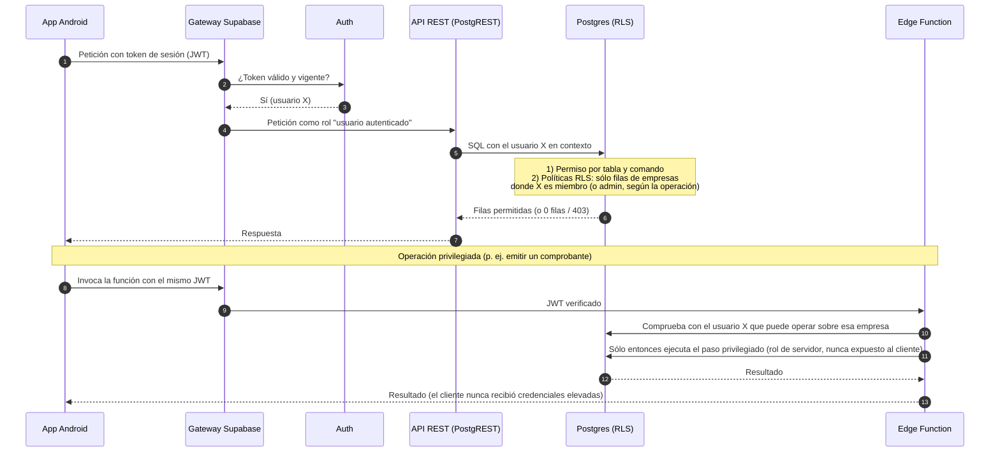

# Seguridad

Este documento explica los **principios y las capas** con que TaxMind protege datos
fiscales y documentos de identidad de sus usuarios: qué controles existen y por qué.

---

## 1. Capas de autorización de una petición

<!-- mmd:08-cadena-autorizacion.mmd -->

Toda petición de la app o del panel atraviesa, en orden:

1. **Sesión.** El gateway de Supabase valida el JWT: sin sesión válida la petición no
   llega a la base de datos ni a las funciones. La app renueva el token en silencio y, si
   no puede, vuelve al inicio de sesión.
2. **Permiso por tabla y comando.** El rol de usuario autenticado sólo tiene concedidos
   los comandos (leer, insertar, actualizar) que realmente necesita en cada tabla. Las
   tablas internas no tienen ningún permiso para ese rol.
3. **RLS por fila.** Cada fila de negocio pertenece a una empresa; la política comprueba
   que el usuario es miembro de esa empresa (o admin, según la operación). Un usuario
   nunca ve, ni por error, datos de una empresa ajena.
4. **Triggers de protección.** Aunque la fila sea suya, ciertos campos sólo los escribe
   el servidor (número de comprobante, fecha de emisión, estado de un pago, verificación
   del responsable, transiciones de estado). La app puede mandar el campo; se ignora o se
   fuerza al valor seguro.
5. **Restricciones de integridad.** Cuadre de montos, unicidad del número por empresa,
   formatos de RIF y cédula, reglas de las notas de crédito y débito.
6. **Operaciones privilegiadas sólo del lado servidor.** Emitir un correlativo, acreditar
   créditos, llamar a OpenAI, consultar el SENIAT, enviar correo. Se hacen en funciones de
   base de datos con privilegios o en Edge Functions que primero comprueban, actuando
   *como el usuario*, que puede operar sobre esa empresa, y sólo después usan un cliente
   con privilegios para el paso concreto. **El cliente jamás recibe credenciales
   elevadas**; la clave de servidor no existe fuera del backend.

Y el panel admin suma dos capas antes de la primera: acceso perimetral y segundo factor
(§6).

---

## 2. Cerrado por defecto

- Toda tabla nueva nace con RLS activada y **sin permisos** para el rol de usuario; se
  abre explícitamente en la misma migración, y sólo lo que tiene política. Nada de
  privilegios por defecto que abran tablas sin querer.
- El rol anónimo no tiene acceso a nada: la app exige sesión para todo.
- Los helpers internos de RLS viven en un esquema que la API no expone.
- Cuando se detectó un camino que permitía a un usuario autenticado vincularse a una
  empresa ajena conociendo su identificador, se cerró con una migración y se dejó
  documentado.
- Errores "anti-oráculo": "no existe", "no es tuya" y "eres miembro pero no admin"
  responden igual, para no revelar qué empresas o registros existen.

---

## 3. Multi-tenant con dos roles

Un usuario pertenece a una o varias empresas con rol **admin** u **operador**. Cualquier
miembro registra facturas y emite comprobantes; sólo un admin edita la empresa, declara
al responsable legal, sube la firma y el sello, invita y gestiona miembros, reporta pagos
y anula comprobantes. Una empresa nunca se queda sin admin. Las invitaciones son códigos
aleatorios de un solo uso con vencimiento, de los que sólo se guarda un *hash*, con
límite de intentos de canje por usuario y respuestas que no distinguen "vencido" de
"inexistente".

---

## 4. Verificación del responsable legal, fuera de la app

Es el control antifraude de identidad central del producto. Un comprobante de retención
es un documento con efectos ante el SENIAT; que alguien opere en nombre de una empresa que
no representa es el riesgo que hay que cerrar.

- **La app sólo declara.** El admin registra los datos del responsable y sube la foto de
  su documento. Eso deja a la empresa en estado *pendiente*: puede registrar facturas,
  pero **no puede emitir comprobantes**.
- **La habilitación la hace una persona, por un canal separado.** El equipo TaxMind
  revisa el caso en el panel admin (documento, datos declarados, señales automáticas) y lo
  verifica o lo rechaza con motivo. La app se entera y notifica; el estado no se puede
  cambiar desde el cliente. Cambiar el documento o la foto obliga a re-verificar.
- **Por qué no es automático.** Ninguna señal automática es prueba de identidad; la
  decisión final tiene que ser de una persona con criterio, y quedar auditada.
- El mecanismo técnico que hace este control inviolable desde el cliente no se describe
  aquí, a propósito.

### Señales no autoritativas

Antes de que una persona revise, el sistema aporta dos señales:

| Señal | Qué aporta | Por qué no basta |
|---|---|---|
| **Lectura del documento** por visión IA | Extrae número y nombre del documento y los compara con lo declarado; marca coincidencias y discrepancias. | La IA se equivoca, un documento puede ser ajeno o alterado; sirve para priorizar y detectar errores de tipeo, no para habilitar. |
| **Consulta del RIF** en el portal del SENIAT | Confirma que el RIF de la empresa existe y a qué razón social corresponde. | Dice que la empresa existe, no que quien está del otro lado la representa. |

Las señales se guardan como tales, visibles para el revisor; ninguna cambia el estado de
verificación por sí sola.

---

## 5. Datos personales y archivos

- Los documentos de identidad, las firmas y sellos y las capturas de pago viven en
  buckets **privados**, separados por tipo y con límites de tamaño y formato. Sólo el
  admin de la empresa los sube; el equipo TaxMind sólo accede a los que necesita para
  verificar (documentos y capturas), no a las facturas ni a los comprobantes.
- Cuando hace falta un enlace, es una **URL firmada de corta vida**; nunca se incluyen
  enlaces a imágenes en correos. En el panel admin los archivos se descargan
  autenticados a memoria y se descartan al cerrar la vista.
- El correo al equipo sobre un responsable pendiente lleva un resumen, no la imagen.
- El registro de aceptación de términos y privacidad es inmutable y versionado; una
  versión nueva de los términos obliga a re-aceptar en la app.
- La telemetría de uso de IA no guarda datos personales, sólo tokens, modelo, costo y
  éxito.

---

## 6. Panel admin

El panel es la superficie más sensible (verifica identidades y mueve créditos), así que
acumula capas:

1. **Acceso perimetral** — Cloudflare Access delante del dominio, con lista cerrada de
   correos: quien no está en la lista no llega ni a la pantalla de login.
2. **Sesión** — correo y contraseña de Supabase Auth, guardada sólo mientras dura la
   pestaña.
3. **Lista cerrada de administradores de plataforma** — comprobada en el servidor en
   cada operación (revocar a alguien corta el acceso aunque su sesión siga viva; el panel
   lo expulsa en el siguiente sondeo). Independiente de la lista de Access: son dos capas
   que se mueven juntas.
4. **MFA obligatoria** — TOTP; sin segundo factor no se ve el panel, y toda escritura
   exige el nivel de aseguramiento 2 **comprobado en el servidor**, no sólo en la UI. El
   nivel se revalida al renovar el token y al volver a la pestaña.
5. **Auditoría de cada acción**, incluidas las lecturas sensibles (abrir el detalle de
   un pago con su captura, el detalle de un responsable, exportar CSV).
6. **Cabeceras endurecidas** — CSP estricta (sólo el propio origen y el proyecto
   Supabase), sin embebido en otros sitios, sin indexación, HSTS.
7. **Realtime sin filas** — los avisos en tiempo real sólo dicen "cambió algo"; los datos
   se piden después por la API bajo RLS.

---

## 7. Otros controles

- **Cupos anti-abuso** por empresa en la extracción por IA y en el canje de códigos;
  sin créditos no se llama a la IA.
- **Integridad del APK**: el manifiesto de actualización y el sitio publican el hash
  SHA-256 del binario; la app se instala sobre la anterior sólo si la firma coincide.
- **Secretos**: ninguna clave de servicio externo, ni la clave de servidor, está en los
  repositorios ni en la app; sólo la clave *anon* publicable, que por sí sola no abre
  nada porque el rol anónimo no tiene permisos.
- **Tests de seguridad**: los scripts E2E prueban explícitamente los casos negativos
  (403 por no ser admin, 401 sin sesión, 402 sin créditos, 429 por cupo, intentos de
  auto-verificación, canje de códigos inválidos).

---

## Qué no incluye este documento

Ni la lista de funciones que se invocan desde la base de datos ni cómo se autentican
entre sí, ni la configuración de JWT por función, ni los nombres de los helpers de RLS,
ni cualquier detalle que sirva para planificar un ataque. Si eres investigador de
seguridad y encontraste algo, escríbenos a la dirección publicada en `security.txt` del
sitio.

[← Volver al índice](../README.md)
