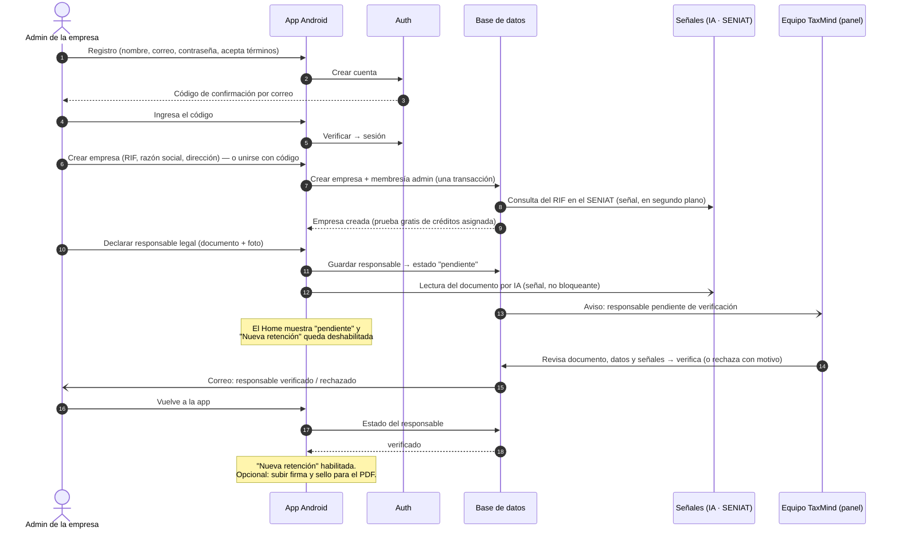
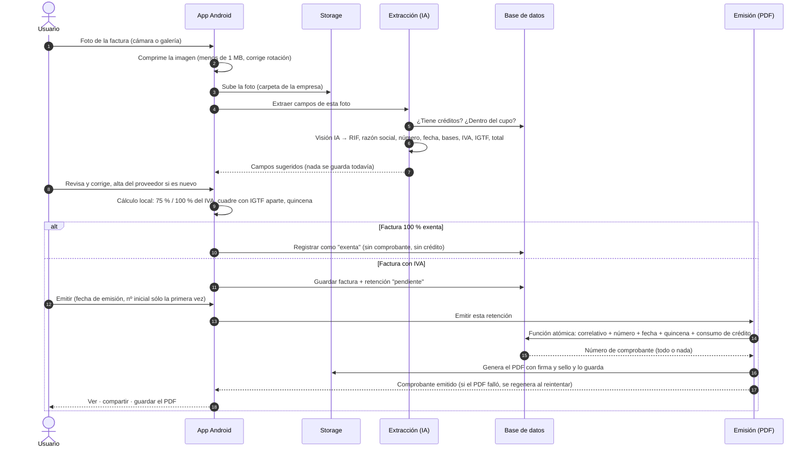
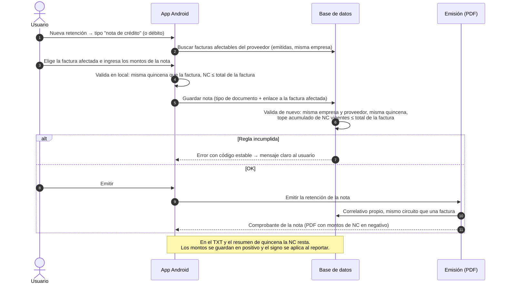
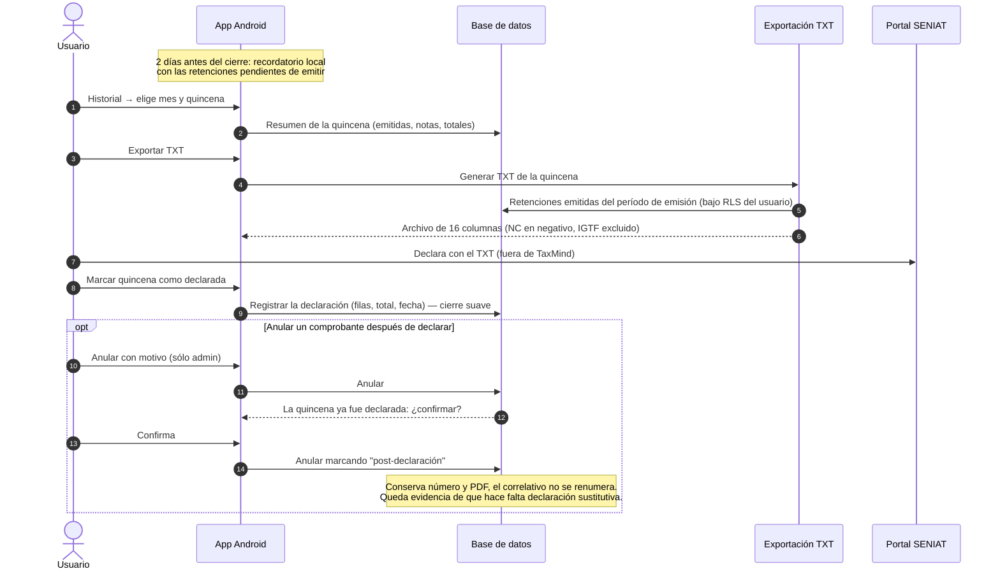
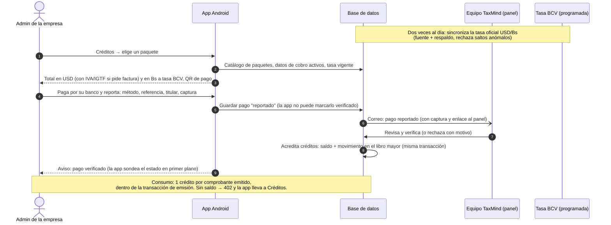
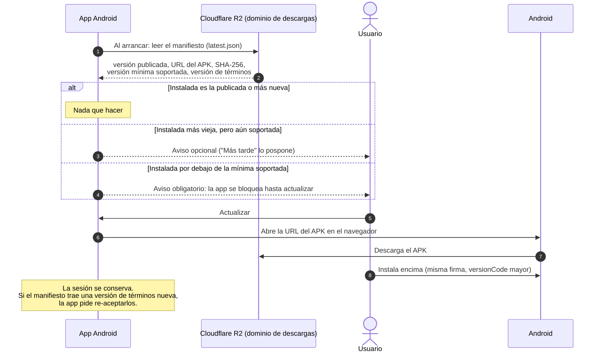
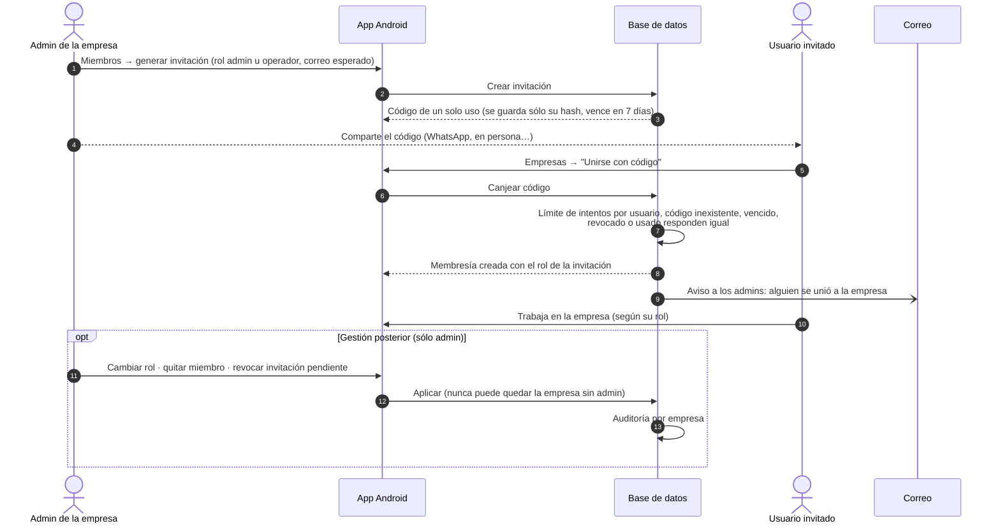

# Flujos

Siete secuencias que cubren la vida de una empresa en TaxMind: desde el registro hasta la
declaración de la quincena, pasando por los pagos y la colaboración. En todos los
diagramas los participantes se nombran **por rol** ("Extracción", "Emisión", "Base de
datos"), no por el nombre de ninguna función o tabla.

| # | Flujo | Quién lo vive |
|---|---|---|
| 1 | [Onboarding](#1-onboarding) | admin de una empresa nueva |
| 2 | [Foto → extracción → comprobante](#2-foto--extracción--comprobante) | cualquier miembro |
| 3 | [Notas de crédito y débito](#3-notas-de-crédito-y-débito) | cualquier miembro |
| 4 | [Cierre de quincena y TXT SENIAT](#4-cierre-de-quincena-y-txt-seniat) | quien declara; admin para anular |
| 5 | [Créditos y pagos](#5-créditos-y-pagos) | admin de la empresa + equipo TaxMind |
| 6 | [Actualización de la app](#6-actualización-de-la-app) | cualquier usuario |
| 7 | [Colaboración multiempresa](#7-colaboración-multiempresa) | admin + invitado |

---

## 1. Onboarding

Del registro a poder emitir. La pieza clave es que **la app sólo declara** al responsable
legal; la habilitación la hace una persona desde el panel, con las señales automáticas
como apoyo (ver [Seguridad §4](05-seguridad.md#4-verificación-del-responsable-legal-fuera-de-la-app)).

<!-- mmd:09-flujo-onboarding.mmd -->

Notas:

- La cuenta se confirma con un código de un solo uso enviado por correo (no con un
  enlace), pensado para un flujo 100 % móvil.
- Crear la empresa asigna la prueba gratis de créditos (una sola vez por RIF).
- Mientras el responsable está pendiente, la empresa ya puede registrar facturas y
  proveedores; sólo la **emisión** queda bloqueada.
- Un usuario que se une con código de invitación entra directo a una empresa ya
  configurada y se salta la declaración del responsable.

---

## 2. Foto → extracción → comprobante

El flujo central del producto: de una foto a un comprobante con correlativo en menos de
un minuto.

<!-- mmd:10-flujo-foto-comprobante.mmd -->

Notas:

- La imagen se comprime en el teléfono (tamaño máximo, lado mayor acotado, rotación
  EXIF corregida) antes de subir; las facturas térmicas largas usan un lado mayor más
  generoso.
- La extracción **no guarda nada**: devuelve campos sugeridos y el usuario siempre revisa.
  El IGTF se detecta y se separa del IVA; las series de talonario se combinan con el
  número; hay un cupo por empresa y una espera visible si se supera.
- El cálculo (75 % o 100 % del IVA según la empresa, con override por retención; cuadre
  del total con IGTF aparte; período y quincena) se hace en el teléfono para mostrarlo al
  instante y **se repite en el servidor** al emitir.
- Una factura 100 % exenta se registra como tal: queda en el historial sin comprobante,
  sin correlativo y sin gastar crédito.
- La emisión es **una transacción**: correlativo, número, fecha, quincena y consumo del
  crédito, o nada. El PDF se genera después y se guarda; si falla, el número ya asignado
  no se pierde y el reintento sólo regenera el PDF. El PDF lleva la firma y el sello de la
  empresa si los subió.
- La primera emisión de la empresa permite fijar el número inicial para continuar la
  numeración de un sistema anterior; después es automático.

---

## 3. Notas de crédito y débito

Una nota se registra como un documento más, ligado a la factura original, y sigue el
mismo circuito de emisión.

<!-- mmd:15-flujo-notas-credito-debito.mmd -->

Notas:

- La factura afectada debe ser de la misma empresa y proveedor y estar en la **misma
  quincena** (el SENIAT rechaza un TXT con una nota "aislada").
- Las notas de crédito acumuladas no pueden superar el total de la factura; tampoco se
  puede reducir después el total de una factura que ya tiene notas.
- La nota tiene su propio comprobante y correlativo; en el PDF, el TXT y el resumen de
  quincena una nota de crédito aparece en negativo.

---

## 4. Cierre de quincena y TXT SENIAT

<!-- mmd:11-flujo-txt-seniat.mmd -->

Notas:

- El TXT sigue la guía oficial (16 columnas, tabulado, sin encabezado), agrupa por
  **período de emisión** y excluye el IGTF del total de la factura.
- "Marcar como declarada" es un **cierre suave**: registra cuándo se declaró y con qué
  totales, sin renumerar ni congelar nada. Puede repetirse (declaraciones sustitutivas).
- Anular después de declarar pide confirmación explícita y deja marca de
  "post-declaración"; el número y el PDF se conservan.
- Un recordatorio local (WorkManager) avisa dos días antes del cierre si hay pendientes,
  con acceso directo al historial filtrado.

---

## 5. Créditos y pagos

Modelo prepago sin pasarela: la empresa paga por su banco y reporta; el equipo verifica y
acredita.

<!-- mmd:12-flujo-creditos-pagos.mmd -->

Notas:

- La app muestra el total en USD y en bolívares a la **tasa oficial del día**, que una
  tarea programada sincroniza dos veces al día (con fuente de respaldo y rechazo de
  variaciones anómalas); si la tasa tiene más de una semana, no se muestra el monto en Bs.
- El reporte exige captura y, para pago móvil, los datos del titular; el pago nace
  siempre como "reportado" aunque la app intente otra cosa.
- La verificación y la acreditación son del panel; la acreditación escribe saldo y libro
  mayor en la misma transacción, y es la única vía de sumar créditos.
- La app avisa con una notificación cuando el pago pasa a verificado o rechazado, y
  puede generar un PDF informativo del pago verificado.

---

## 6. Actualización de la app

<!-- mmd:16-flujo-actualizacion-app.mmd -->

Notas:

- El manifiesto y el APK viven en Cloudflare R2 bajo un dominio propio, con URLs
  estables que se sobrescriben en cada versión; el sitio publica versión, fecha, tamaño y
  SHA-256 para que cualquiera verifique su descarga.
- La versión mínima soportada permite retirar versiones rotas contra el backend sin
  esperar a que el usuario actualice por su cuenta.
- El mismo manifiesto transporta la versión vigente de los términos: subirla obliga a
  re-aceptarlos en la app.

---

## 7. Colaboración multiempresa

<!-- mmd:17-flujo-colaboracion.mmd -->

Notas:

- El código es aleatorio y de un solo uso, con vencimiento; sólo se guarda un *hash* y se
  muestra en claro una única vez.
- El canje tiene límite de intentos y no revela si un código existe, venció o fue
  revocado.
- Roles: **admin** (todo) y **operador** (registrar y emitir). Nunca puede quedar una
  empresa sin admin. Los cambios de miembros y las invitaciones quedan en la auditoría de
  la empresa y hay un feed de actividad para los admins.

[← Volver al índice](../README.md)
