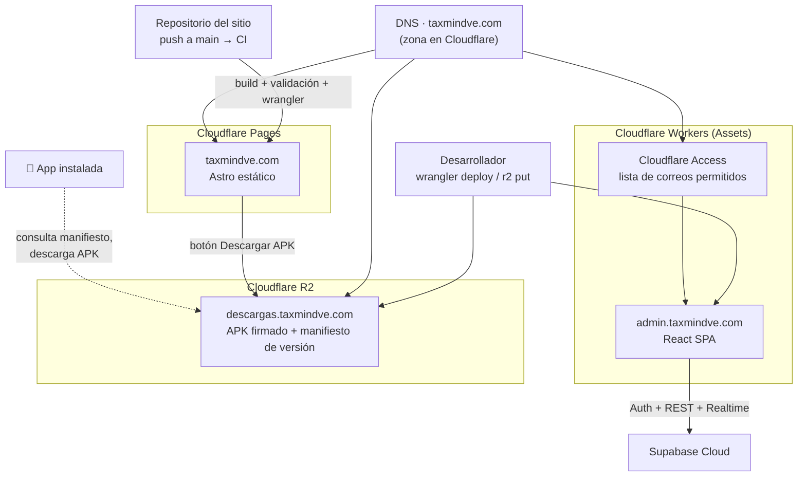

# Sitio público y panel admin

Dos aplicaciones web pequeñas, ambas en Cloudflare, con modelos de hosting distintos a
propósito: el sitio es **estático** (Pages) y el panel es una **SPA** (Workers Assets)
detrás de Cloudflare Access.

---

## Despliegue en Cloudflare

<!-- mmd:13-cloudflare.mmd -->

| Dominio | Qué sirve | Cómo |
|---|---|---|
| `taxmindve.com` (y `www`) | Sitio público | Cloudflare Pages, deploy automático por CI |
| `admin.taxmindve.com` | Panel de administración | Cloudflare Workers (Assets, modo SPA) + Cloudflare Access |
| `descargas.taxmindve.com` | APK firmado y manifiesto de actualización | Cloudflare R2 con dominio propio |

---

## taxmindve.com — sitio público

**Stack:** Astro 7 con salida estática (sin adaptador SSR), integración de sitemap,
`sharp` para optimizar imágenes en build. Sin framework de UI ni CSS: componentes Astro
puros y una hoja de tokens propia (misma paleta y tipografía que la app). pnpm.

**Estructura:**

- Cuatro páginas: inicio (landing de once secciones), precios, privacidad y términos.
- Un layout base con SEO completo (canonical, Open Graph, Twitter card, JSON-LD de
  `SoftwareApplication` sólo en la home) y un layout "legal" para las dos páginas de
  texto.
- Un componente por sección de la landing (navegación, hero, problema, pasos, bento de
  funcionalidades, planes, formas de pago, confianza, FAQ, CTA final, pie). El menú móvil
  y el acordeón de preguntas usan `
`: cero JavaScript propio.
- **Un solo archivo de datos** (`src/data/sitio.ts`) es la fuente de verdad de todo lo
  variable: identidad, contacto de WhatsApp con mensajes prellenados, catálogo de
  paquetes de créditos y helpers de precio, porcentajes de IVA/IGTF (espejo del cálculo
  de la app), y los datos del APK publicado (URL estable, versión, fecha, tamaño,
  SHA-256). Los componentes no llevan valores literales.
- Capturas reales del emulador con la empresa demo, servidas como WebP por Astro.
- `robots.txt`, sitemap generado, `security.txt`, imagen OG con sufijo de versión para
  refrescar la vista previa en WhatsApp.
- Analítica (GA4) sólo en el build de producción y sólo si hay ID configurado; registra
  dos eventos: descarga del APK y clic a WhatsApp, con la sección de origen.

**Cobro:** el sitio informa precios y formas de pago; la compra y el reporte del pago
ocurren **dentro de la app** (el sitio no habla con el backend). Es un cobro manual
visible en la web: sin pasarela en la versión actual.

**CI/CD:** un único pipeline en `push` a `main`: instala con lockfile
congelado, construye, ejecuta un **validador de `dist/`** (existen las cuatro páginas, no
hay referencias a `localhost`, cada página tiene canonical y descripción, todos los
enlaces y assets internos resuelven, existen sitemap y robots) y sólo si pasa despliega a
Pages con wrangler. Los dos secretos necesarios (token de API y cuenta) viven como secretos
del CI, no en el repo. En el desarrollo, subagentes de revisión (SEO/accesibilidad, verificación
visual y responsive en navegador real) hacen el mismo control antes de commitear.

**Distribución del APK:** el binario no está en el repo (límite de tamaño de Pages y
egress). Vive en R2 con nombre fijo, sobrescrito en cada versión: los enlaces nunca
caducan. El sitio muestra la versión y el hash junto al botón de descarga; el JSON-LD
publica `downloadUrl` y `softwareVersion`.

---

## admin.taxmindve.com — panel de administración

**Stack:** React 19 + Vite 7 + TypeScript estricto, React Router (router de datos),
TanStack Query, Recharts (gráficas de la home), `supabase-js` (Auth, PostgREST,
Storage, Realtime), generación de QR local para previsualizar los métodos de cobro,
fuente self-hosted (la CSP no admite CDNs). Sin Tailwind ni librería de componentes:
una hoja de tokens espejo del sitio. El `build` encadena el *typecheck*: no compila si
hay errores de tipos.

**Hosting:** Cloudflare Workers con Assets en modo *single-page application* (todas las
rutas caen en `index.html`), dominio personalizado creado desde la configuración de
wrangler, variables de build (URL del proyecto y clave anon, publicable por diseño)
inyectadas desde el dashboard. Cabeceras de seguridad servidas con los assets: CSP
estricta limitada al propio origen y al proyecto Supabase, sin embebido, sin
indexación, HSTS.

**Módulos:**

| Módulo | Qué hace |
|---|---|
| Inicio | Alertas proactivas + tres filas de métricas (colas accionables, uso del producto, negocio) desde una sola consulta agregada; refresco cada 60 s; gráficas. |
| Verificaciones | Cola de responsables legales pendientes; detalle con visor del documento, comparación "declarado vs. leído por IA", señales del SENIAT, historial; verificar / rechazar con motivo / revertir. |
| Pagos | Cola de pagos reportados, facturas fiscales por emitir, historial filtrable; detalle con captura embebida, monto esperado desglosado, titular y facturación; verificar (acredita) o rechazar. |
| Créditos | Saldo y libro mayor por empresa, ajuste individual y ajuste en lote atómico, salud del ledger. |
| Empresas / Usuarios | Directorio con búsqueda y export CSV; detalle de empresa (datos fiscales, miembros y roles, responsable, créditos, agregados). Usuarios sin escrituras por diseño. |
| Métodos de pago | Cuentas de cobro que la app muestra al reportar; activar/desactivar surte efecto inmediato. |
| Planes | Catálogo de paquetes con edición inline de precio y estado. |
| Tasa BCV | Tasa vigente, estado de las dos corridas diarias, histórico, inserción manual con control de variación. |
| Auditoría | Feed unificado (auditoría por empresa + auditoría del panel) con filtros y export CSV. |
| Superadmins | Alta y baja de administradores de plataforma, vinculando cuentas existentes; el backend impide dejar el panel sin admin activo. |
| Búsqueda global | Combobox en la barra superior: RIF, razón social, correo, referencia de pago, número de comprobante. |

**Autenticación:** una máquina de estados explícita: sin sesión → login → **guard de
administrador de plataforma en el servidor** (a quien no lo sea se le cierra la sesión
con un mensaje neutro; un fallo de red nunca expulsa) → **TOTP obligatorio** (enrolamiento
forzado si no hay factor; desafío en cada sesión) → panel. El nivel de aseguramiento se
revalida al renovar el token y al volver a la pestaña. La sesión vive en `sessionStorage`
(muere con la pestaña). Cualquier respuesta del servidor que indique "ya no eres admin"
cierra la sesión y vacía la caché de consultas.

**Realtime:** un canal privado al que sólo pueden suscribirse administradores; los
mensajes sólo dicen "cambió tal cosa" y el panel invalida las consultas afectadas (con
un pequeño *debounce*). El sondeo de 60 s se conserva como respaldo.

**Backend:** el panel no invoca Edge Functions; todo son funciones RPC de Postgres
prefijadas para administración (lecturas paginadas, detalles auditados, escrituras que
exigen segundo factor en el servidor, exports con corte de filas) más lecturas de dos
tablas de catálogo y descargas autenticadas de Storage (a memoria, sin URLs
compartibles, fuera de la caché). Unos cincuenta códigos de error estables se traducen a
mensajes en español; cinco códigos de alerta (invariante del ledger, fallo del cron de
tasa, pagos o responsables envejecidos, posible abuso del cupo de IA) se muestran en la
home con enlace a la sección.

**Cloudflare Access:** delante de todo, con lista de correos permitida que hay que
mantener sincronizada con la lista de superadmins (la propia UI lo recuerda). Access debe
existir antes de crear el dominio del Worker.

**Calidad:** typecheck bloqueante en el build; sin tests ni CI propios por ahora (los
scripts E2E del backend cubren las funciones RPC que el panel consume). El deploy es por
Workers Builds conectado al repo o `wrangler deploy` manual.

[← Volver al índice](../README.md)
