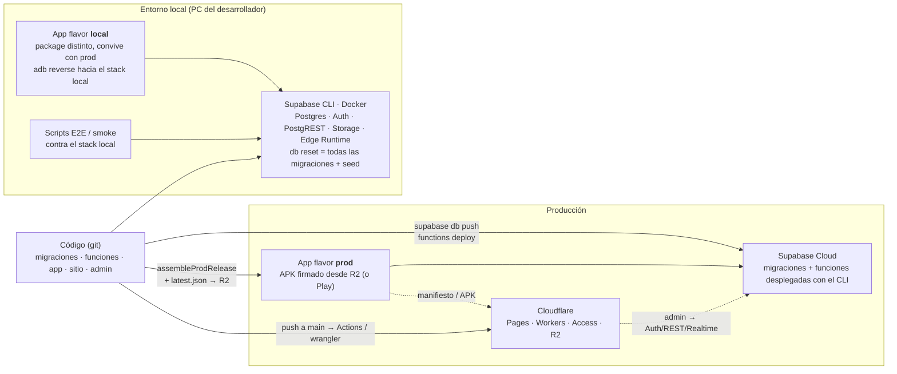

# Infraestructura y despliegue

Dos entornos, cuatro pipelines pequeños y un costo fijo bajo. Este documento describe
cómo se pasa del código al usuario y qué cuesta mantenerlo encendido.

---

## Entornos

<!-- mmd:14-entornos.mmd -->

| | `local` | `prod` |
|---|---|---|
| Backend | Stack completo del CLI de Supabase en Docker (Postgres, Auth, PostgREST, Storage, Edge Runtime, Studio, buzón de correo local) | Supabase Cloud, plan Pro |
| App | Flavor `local`: `applicationId` con sufijo, `versionName` con sufijo, tráfico HTTP en claro sólo hacia el stack local, sin aviso de actualización. Convive instalada con la de producción. | Flavor `prod`: APK firmado |
| Cómo llega el teléfono al backend | `adb reverse` (teléfono físico) o la IP del host del emulador | HTTPS |
| Datos | `db reset` aplica todas las migraciones desde cero + un *seed* que crea el admin de plataforma y los secretos locales; scripts de aprovisionamiento crean empresas demo | Datos reales |
| Secretos de las funciones | archivo `.env` local (ignorado por git) | secretos del proyecto |
| Pruebas | scripts E2E bash y tests Deno contra el stack local; tests JVM de la app | smoke manual tras cada release |

Regla: **nada se prueba por primera vez en producción**. Migraciones y funciones se
ejercitan en local con los scripts E2E antes de `db push` / `functions deploy`.

---

## Ciclo de release de la app

1. Subir `versionCode` (obligatorio para que Android acepte la actualización) y
   `versionName`.
2. `assembleProdRelease` produce el APK **firmado** con una llave de release que vive
   fuera del repositorio (con respaldo): si se perdiera, los usuarios no podrían
   actualizar sin desinstalar. En una máquina sin la llave el build sale sin firmar en
   vez de romperse.
3. Probar la actualización instalando encima de la versión anterior en un teléfono real.
4. Actualizar el **manifiesto** (`latest.json`): versión, URL del APK, hash SHA-256 del
   binario, versión mínima soportada, versión de los términos, notas.
5. Subir APK y manifiesto a Cloudflare R2 con `wrangler` (URLs estables, sólo se
   sobrescriben los objetos), purgar la caché del borde y verificar el hash descargado.
6. Actualizar versión, fecha, tamaño y SHA-256 en el archivo de datos del sitio y hacer
   push: el sitio se despliega solo.

Además, cada commit en `main` se sincroniza a una rama de publicación para Google Play
(sin el cobro embebido) mediante un hook y un agente que corrige conflictos y revisa
políticas de Play. La distribución a testers usa Firebase App Distribution.

---

## Pipelines

| Pieza | Cómo se despliega |
|---|---|
| **Migraciones y funciones** | Supabase CLI desde el repositorio: `db push` para migraciones, `functions deploy` para funciones. Los datos por entorno (secretos, programación de tareas, cuentas de cobro) se cargan aparte. |
| **Sitio** | Pipeline de CI en `push` a `main`: `pnpm install --frozen-lockfile` → `pnpm build` → validador de `dist/` (páginas esperadas, sin `localhost`, canonical y descripción por página, enlaces internos que resuelven, sitemap y robots) → `wrangler pages deploy`. Si el validador falla, no hay deploy. |
| **Panel admin** | `tsc --noEmit && vite build` (el typecheck bloquea) → Cloudflare Workers Builds conectado al repo o `wrangler deploy`. Cloudflare Access debe existir antes del primer deploy del dominio. |
| **APK y manifiesto** | `wrangler r2 object put` a un bucket con dominio propio; purga de caché tras cada reemplazo. |

---

## DNS y Cloudflare

Zona `taxmindve.com` en Cloudflare: apex y `www` → Pages; `admin` → Worker con dominio
personalizado, protegido por Access; `descargas` → R2 con dominio propio (no el endpoint
genérico de R2, que no es para producción). Correo transaccional con dominio verificado
(SPF/DKIM). Ver [Sitio y panel admin](07-sitio-y-admin.md).

---

## Costos aproximados y por qué

| Concepto | Costo | Comentario |
|---|---|---|
| Supabase Pro | ~$25/mes | El único costo fijo relevante. El plan gratuito se pausa por inactividad y su almacenamiento no alcanza para producción; Pro incluye base de datos, Storage y funciones de sobra para la escala actual. |
| Cloudflare Pages / Workers / Access / R2 | $0 | Tiers gratuitos: sitio estático, SPA del admin, Access para un puñado de correos, R2 sin costo de egress (por eso el APK vive ahí y no en el almacenamiento del backend). |
| CI del sitio | $0 | Un job corto por push. |
| OpenAI (visión) | variable, marginal | Fracciones de centavo por factura extraída; medido por llamada en la telemetría interna y cubierto por el precio del crédito. |
| Solución de captcha (consulta de RIF) | variable, marginal | Sólo al verificar el RIF de una empresa. |
| Correo transaccional | $0 | Tier gratuito para el volumen actual. |
| Google Play | $25 una vez | Cuenta de desarrollador (rama de publicación). |
| Dominio | ~$10–15/año | |

En resumen: **hosting ≈ $25/mes fijos** y un costo variable por uso del orden de milésimas
de dólar por comprobante. La razón de la arquitectura es justamente esa: un backend
gestionado con un plan fijo, todo lo estático en tiers gratuitos y el tráfico pesado
(APK) fuera de donde se cobra egress.

---

## Observabilidad y operación

- El panel admin es la consola operativa: alertas proactivas (invariante del libro
  mayor de créditos, fallo del cron de la tasa, colas envejecidas, posible abuso del
  cupo de IA), estado de las tareas programadas, auditoría de plataforma y de cada
  empresa, exports CSV.
- Los correos automáticos al equipo (responsable pendiente, pago reportado) y a los
  usuarios (verificación, nuevo miembro) cierran el ciclo sin mirar el panel todo el día.
- La telemetría de IA (tokens, modelo, costo estimado, éxito) permite vigilar el gasto
  sin guardar datos personales.

[← Volver al índice](../README.md)
